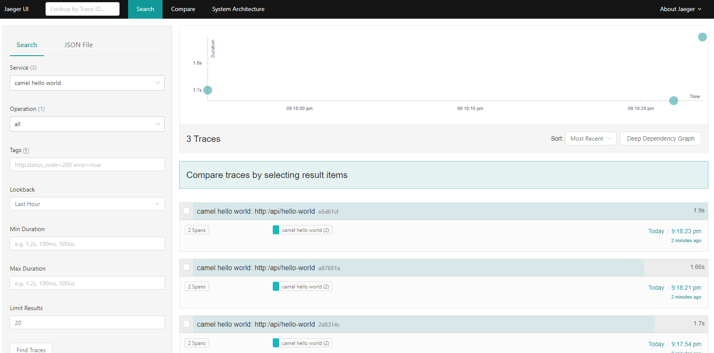
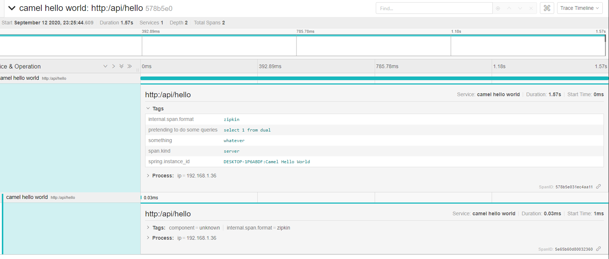

Camel Tracing with Jaeger 
===================

Tools
-------------------
* Programming Language - Java 8
* Library - Red Hat Fuse 7.2

Concept 
-------------------
An example on doing a transaction tracing with JBoss Fuse, or its opensource version which is Apache Camel, and Jaeger. 

Im using spring sleuth and zipkin, and configure them on `application.properties` file to capture all http request. Without have to change existing camel xml files.

The interesting part is actually on how to do a span and tagging mechanism with `Tracer` to add a customized tag message to be displayed on Jaeger Dashboard .



We can see two customized tags here, `something` and `pretending to do some queries`. 


How to Run
------------------

```
mvn spring-boot:run -s settings.xml
```

Blog Post
------------------
```
https://edwin.baculsoft.com/2020/09/tracing-red-hat-fuse-transaction-with-jaeger/
```

Reference 
-------------------
```
https://camel.apache.org/components/latest/others/opentracing.html
```

```
https://access.redhat.com/documentation/en-us/red_hat_fuse/7.7/html/apache_camel_component_reference/opentracing-opentracingcomponent
```
